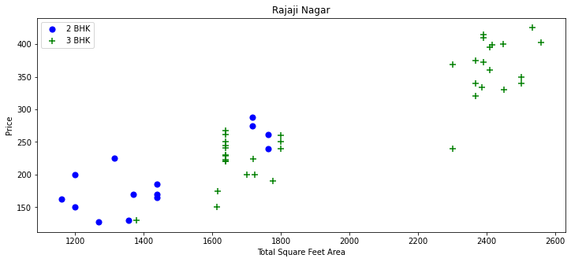
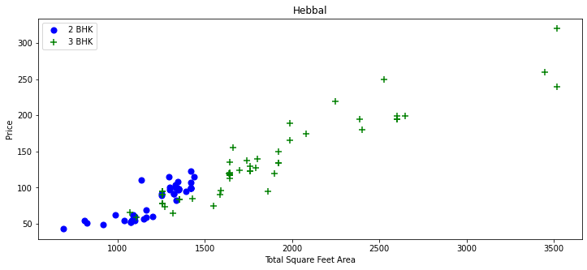
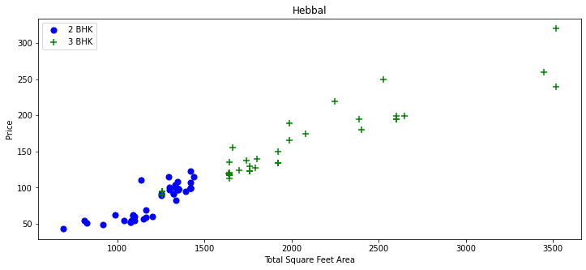
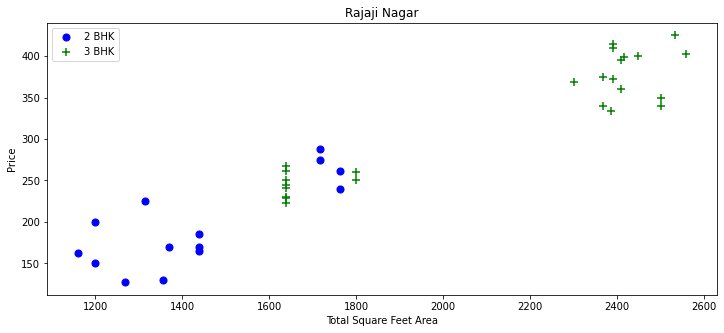
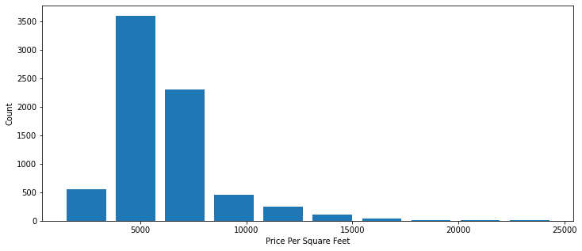

# Preços de Imóveis em Bangalore, Índia (Modelo de Regressão)
### Projeto de Machine Learning

Neste projeto de ciência de dados, utilizei dados sobre os imóveis disponíveis na cidade de Bangalore na Índia, com o propósito analítico de treinar um modelo de regressão que seja útil para realizar predições sobre o preço dos imóveis de tal cidade indiana. 

Durante o projeto, realizei dois passos sequenciais, que foram **(1)** tratamento de dados e **(2)** construção do modelo de machine learning, na **(1)** etapa do projeto transformei, limpei e manipulei os dados, para que os dados de cada coluna estivéssem adequados para serem implementados no modelo de aprendizagem maquínica, ou seja, nesta fase, removi erros, converti os dados do tipo texto para o tipo numérico, e principalmente lidei com valores atípicos e dados nulos, para que o conjunto de dados estivesse idealmente preparado para ser treinado pelo modelo de regressão que será aplicado.

Já na **(2)** fase construí um modelo de machine learning, isto é, importei o modelo de regressão linear, dividi o conjunto de dados tratado entre dados de treino e dados de teste, e consequentemente treinei o modelo, para depois ter uma análise do quão eficaz era o modelo em realizar previsões sobre o preço dos imóveis, após isto, repeti este mesmo processo repetidas vezes, assim, usei outros modelos de regressão, junto com algumas técnicas como validação cruzada e GridSearch, para saber quais eram os melhores modelos e quais eram os melhores parâmetros dos modelos para realizar previsões mais precisas e acuradas.

### Importação das bibliotecas:

Para este projeto, utilizei Pandas e Numpy para manipulação dos dados, Matplotlib e Seaborn foram usados para visualização de dados, e Sklearn foi a biblioteca útil para a construção do modelo de machine learning.

```
# Importação de bibliotecas:

import pandas as pd
import numpy as np
import seaborn as sns
import matplotlib.pyplot as plt
import matplotlib
%matplotlib inline
```

Após a importação de tais bibliotecas, importei o conjunto de dados e verifique tal dataset contêm 13 mil e 320 linhas, e 9 colunas, abaixo está uma visualização das cinco primeiras linhas do conjunto de dados importado relativo aos imóveis da cidade de Bangalore:

|   | area_type           | availability  | location                 | size      | society | total_sqft | bath | balcony | price  |
|---|---------------------|---------------|--------------------------|-----------|---------|------------|------|---------|--------|
| 0 | Super built-up Area | 19-Dec        | Electronic City Phase II | 2 BHK     | Coomee  | 1056       | 2.0  | 1.0     | 39.07  |
| 1 | Plot Area           | Ready To Move | Chikka Tirupathi         | 4 Bedroom | Theanmp | 2600       | 5.0  | 3.0     | 120.00 |
| 2 | Built-up Area       | Ready To Move | Uttarahalli              | 3 BHK     | NaN     | 1440       | 2.0  | 3.0     | 62.00  |
| 3 | Super built-up Area | Ready To Move | Lingadheeranahalli       | 3 BHK     | Soiewre | 1521       | 3.0  | 1.0     | 95.00  |
| 4 | Super built-up Area | Ready To Move | Kothanur                 | 2 BHK     | NaN     | 1200       | 2.0  | 1.0     | 51.00  |

Nem todas às colunas do dataset foram usadas para prever o preço dos imóveis, além de que antes de construir o modelo de regressão é necessário converter dados textuais em dados numéricos, e principalmente é indispensável lidar com dados ausentes e outliers para não ter erros na construção do modelo preditivo, à partir deste ponto comecei a fase de tratamento e limpeza de dados:

### Tratamento de dados:

Primeiramente, exclui algumas colunas que considerei que não fossem impactantes na previsibilidade de preço dos imóveis, além de que tal exclusão de colunas ajuda na redução de dimensionalidade, e isto ajuda na velocidade de processamento de treino do modelo:

```
df_2 = df.drop(['area_type', 'availability', 'society', 'balcony'],
        axis = 'columns')
```
Após tal exclusão de colunas, obtive esse novo dataframe com menos colunas à serem analisadas:

|   | location                 | size      | total_sqft | bath | price  |
|---|--------------------------|-----------|------------|------|--------|
| 0 | Electronic City Phase II | 2 BHK     | 1056       | 2.0  | 39.07  |
| 1 | Chikka Tirupathi         | 4 Bedroom | 2600       | 5.0  | 120.00 |
| 2 | Uttarahalli              | 3 BHK     | 1440       | 2.0  | 62.00  |
| 3 | Lingadheeranahalli       | 3 BHK     | 1521       | 3.0  | 95.00  |
| 4 | Kothanur                 | 2 BHK     | 1200       | 2.0  | 51.00  |

As colunas do conjunto de dados acima representam informações relativas à:

* location: Localização do imóvel na cidade de Bangalore
* size: Quantidade de quartos presentes no imóvel
* total_sqft: Área total do imóvel em pés quadrados
* bath: Quantidade de banheiros presentes no imóvel
* price: Preço do imóvel 

Após isto, verifiquei a quantidade de dados ausentes no conjunto de dados com o método .isnull().sum() do Pandas:

* **Dados Nulos**:

```
location       1
size          16
total_sqft     0
bath          73
price          0
dtype: int64
```

Acima é observável que há 73 linhas com dados ausentes na coluna 'bath' relativo à quantidade de banheiro presentes no imóvel, e há 16 linhas com dados ausentes na coluna 'size' relativo à quantidade de quartos de cada imóvel.

Como são poucos dados nulos, decidi exclui-los para ter um conjunto de dados menor e consequentemente prosseguir com o tratamento, poderia ter usado outras técnicas para lidar com dados nulos sem perder informações adicionais, mas considero que está foi a melhor decisão à ser tomada:

```
df_3 = df_2.dropna()
```

Com o método .dropna() aplicado acima, obtive um conjunto de dados menor com 13 mil e 246 linhas.

Concluído o tratamento de dados nulos, comecei a lidar com às variáveis do dataset que eram do tipo categórica e estavam em formato textual.

* **Conversão de tipo de dados**:

A coluna 'size' representa a quantidade de quartos de cada imóvel, porém o tipo de dados da coluna era do tipo object (texto) e tal coluna continha letras presentes em seus valores.

O método .unique() me trouxe a informação sobre os valores únicos da coluna 'size':

```
['2 BHK', '4 Bedroom', '3 BHK', '4 BHK', '6 Bedroom', '3 Bedroom',
       '1 BHK', '1 RK', '1 Bedroom', '8 Bedroom', '2 Bedroom',
       '7 Bedroom', '5 BHK', '7 BHK', '6 BHK', '5 Bedroom', '11 BHK',
       '9 BHK', '9 Bedroom', '27 BHK', '10 Bedroom', '11 Bedroom',
       '10 BHK', '19 BHK', '16 BHK', '43 Bedroom', '14 BHK', '8 BHK',
       '12 Bedroom', '13 BHK', '18 Bedroom']
```
É vísivel que não há como converter o tipo de dados da coluna 'size' de object para int, sem antes excluir os elementos textuais que estão presentes nos dados de tal coluna, então para excluir às letras contidas nos dados e deixar somente os números que representam a quantidade de quartos dos imóveis, construí uma função que iria manter somente os números e iria excluir todas às letras que estavam presentes na coluna 'size':

```
# Conversão da coluna 'size' de tipo textual (object) para tipo numérico (int):

df_3['bhk'] = df_3['size'].apply(lambda x : int(x.split(' ')[0]))
```

Além de ter mantido somente os números de cada dado da coluna 'size', aproveitei para converter o tipo de dado da coluna de tipo object (texto) para tipo int (numérico), para que pudesse ter tal coluna preparada para ser implementada no modelo de machine learning.

Apliquei novamente o método .unique() para ver o resultado da função .apply() aplicada na coluna 'size':

```
[ 2,  4,  3,  6,  1,  8,  7,  5, 11,  9, 27, 10, 19, 16, 43, 14, 12,
       13, 18]
  ```
Após tal conversão da coluna 'size', fui verificar os valores únicos da coluna 'total_sqtf' com o método .unique(), e vi que tal coluna é do tipo object, e que há dados textuais na coluna que impedem a coluna de ser convertida diretamente de object para int:

```
['1056', '2600', '1440', ..., '1133 - 1384', '774', '4689']
```
O traço '-' em um dos dados da coluna foi um dos impecilhos que tive que lidar para transformar essa coluna do tipo texto para o tipo numérico.

Com isto, construí uma função pythônica com o objetivo de filtras os dados da coluna 'total_sqtf' que seriam impedidos de ser convertidos para o tipo numérico por conterem aquele '-' ou por conterem letras que impedissem tal conversão:

```
# Função para converter os valores da coluna 'total_sqft' de tipo texto (object) para tipo numérico com casa decimal (float):

def is_float(x):
  try:
    float(x)
  except:
    return False
  return True
 ```
 
A função acima tenta converter o dado para o tipo float (número decimal), caso a função não consiga, então a função retorna False (0), caso contrário retorna True (1).

Usei tal função construída para filtrar os dados da coluna 'total_sqft' que não poderiam ser convertidas diretamente de object para float:

```
# Filtro de todos os valores da coluna 'total_sqft' que não são conversíveis para tipo float,
# por conterem caracteres não-numéricos:

df_3[~df_3.total_sqft.apply(is_float)].head(10)
```

Vi que há 190 dados de tal coluna que não poderiam ser convertido de object para floa diretamente, verifique algumas poucas linhas abaixo da aplicação de tal filtro:

|     |           location |  size |  total_sqft | bath |   price | bhk |
|-----|-------------------:|------:|------------:|-----:|--------:|----:|
|  30 |          Yelahanka | 4 BHK | 2100 - 2850 |  4.0 | 186.000 |   4 |
| 122 |             Hebbal | 4 BHK | 3067 - 8156 |  4.0 | 477.000 |   4 |
| 137 | 8th Phase JP Nagar | 2 BHK | 1042 - 1105 |  2.0 |  54.005 |   2 |
| 165 |           Sarjapur | 2 BHK | 1145 - 1340 |  2.0 |  43.490 |   2 |
| 188 |           KR Puram | 2 BHK | 1015 - 1540 |  2.0 |  56.800 |   2 |

Para retirar os traços de tais dados e deixar somente um valor numérico, decidi calcular a média entre os dois números do lado de cada traço para poder excluir o traço e manter um valor aproximado em relação à área em pés quadrados destes imóveis.

Para este fim, construí mais uma função pythônica:

```
# Função para retirar a média de área em pés quadrados de valores que apresentam um intervalo numérico e aproximado,
# além de tal função converter tais elementos da coluna 'total_sqft' para o tipo float:

def convert_sqft_to_num(x):
  tokens = x.split('-')
  if len(tokens) == 2:
    return (float(tokens[0]) + float(tokens[1])) / 2
  try:
    return float(x)
  except:
    return None
 ```
A função acima separa cada dado com base no traço '-', e assim verifica se esse dado contêm dois valores (que seriam os dois números separados pelo traço), e se tal dado contêm dois valores, então tal função irá retornar a média entre esses dois valores.

Caso o dado não contenha dois valores, então a função irá converter diretamente o valor para o tipo float (número decimal).

Um exemplo de aplicação da função construída seria:

```
# Teste da função para retirar a média de elemento que apresenta um valor estimado e aproximado da área em pés quadrados dentro de um intervalo:

convert_sqft_to_num('2100 - 2850')
```
A função acima retornaria 2475.0 que é a média entre 2100 e 2850.

Após o teste de tal função, apliquei-a sobre a coluna 'total_sqft' para converter todos os dados da coluna diretamente de object para float, e assim consegui ter mais uma coluna preparada para a implementação do modelo de regressão.

```
# Aplicação da função para converter todos os valores da coluna 'total_sqft' de texto para tipo flutuante (float):

df_4['total_sqft'] = df_4['total_sqft'].apply(convert_sqft_to_num)
```
* **Redução de dimensionalidade**:

Nesta frase de tratamento dos dados, vi que precisava converter a coluna 'localization' de texto para número inteiro, e para fazer isto teria que usar variáveis dummy para converter cada nome de localização da coluna 'localization' em uma coluna numérica de 0's e 1's que iria ter 1 para afirmar quando um imóvel estaria presente em tal localização, e 0 para negar que tal imóvel estivesse presente em tal localização.

No entanto, para realizar tal transformação, tive que verificar a quantidade de valores únicos na coluna 'localization', isto é, a quantidade de localizações diferentes em que os imóveis de Bangalore estão localizados.

```
# Quantidade de valores únicos de localizações que contêm imóveis registrados em Bangalore, Índia:

len(df_5.location.unique())
```
O método len de Python me trouxe o resultado de que há 1.304 localizações diferentes em Bangalore com imóveis presentes, e neste caso se fosse criado uma variável dummy para cada localização, iria acabar tendo 1.304 colunas adicionais no conjunto de dados, ou seja, teríamos mais peso informacional para a análise e consequentemente o modelo de regressão poderia demorar mais tempo para ser treinado e para realizar previsões sobre o preço dos imóveis.

Para evitar esse número exagerado de colunas adicionais, resolvi saber quais eram as localizações que continham mais imóveis e quais que continham menos imóveis em Bangalore.

Usei o método .groupby de Pandas para saber a quantidade de imóveis presentes por localização em Bangalore:

```
# Agrupamento da quantidade de imóveis por localização presentes em Bangalore:

location_stats = df_5.groupby('location')['location'].agg('count').sort_values(ascending = False)
```
Abaixo está uma visualização breve da quantidade de imóveis por localização:

```
location
Whitefield               535
Sarjapur  Road           392
Electronic City          304
Kanakpura Road           266
Thanisandra              236
                        ... 
1 Giri Nagar               1
Kanakapura Road,           1
Kanakapura main  Road      1
Karnataka Shabarimala      1
whitefiled                 1
Name: location, Length: 1293, dtype: int64
```

É notável que há localizações em Bangalore que contém somente um imóvel presente, após tal notação, decidi saber a quantidade de localizações na cidade indiana que há menos de 10 imóveis presentes:

```
# Quantidade de localizações que contêm menos de 10 imóveis:

len(location_stats[location_stats <= 10])
```
Como saída, obtive que há 1.052 localizações em Bangalore que há 10 ou menos imóveis presentes.

Com tal informações, filtrei as localizações que contêm 10 ou menos imóveis presentes e os atribuí à uma nova variável:

```
# Atribuição de tais localizações com menos de 10 imóveis à uma nova variável:

location_stats_less_than_10 = location_stats[location_stats <= 10]
```
Com tais localizações atribuídas à uma nova variável, decidi substituir cada nome de localização por 'outro', caso tal localização esteja inserida na lista de localizações com 10 ou menos imóveis presentes, ou seja, apliquei essa função abaixo sobre a coluna 'localization':

```
# Aplicação de função para substituir os nomes das localizações com menos de 10 imóveis à uma mesma classe, denominada 'outros':

df_5.location = df_5.location.apply(lambda x : 'other' if x in location_stats_less_than_10 else x)
```
Caso os nomes de localização da coluna 'localization' estejam inseridos na lista com 10 ou menos imóveis, então os nomes de tais localizações serão substituídos por 'outro' para que todas essas 1.052 localizações diferentes estejam atribuídas à uma mesma classe em comum.

Assim, após tal transformação, consegui diminuir a quantidade de localizações diferentes de 1.304 para 242 localizações.

Neste caso, ao transformar a coluna 'localization' em variável dummy, terei somente 242 colunas adicionais ao invés das 1.304 que seriam tidas.

* **Tratamento de outliers**:

Nessa última fase do tratamento de dados, decidi usar algumas técnicas e avaliar algumas colunas do dataset para saber se há dados atípicos (outliers) em tais colunas ou não.

De início, adicionei uma coluna no dataset que informasse o preço em rupee (moeda indiana) por pé quadrado de cada imóvel de Bangalores, para que posteriormente pudesse identificar valores extremos e assim exclui-los.

```
# Criação da coluna de preço por pés quadrados para verificarmos posteriormente outliers (valores atípicos) e eliminarmos:

df_5 = df_5.assign(price_per_sqft = df_5['price'] * 100000 / df_5['total_sqft'])
```

Após a criação de tal coluna, filtrei imóveis no dataset que tivessem quartos com uma área menor de 300 pés quadrados, por considerar que tais imóveis poderiam ter quartos com uma área pequena e incomum em relação ao tamanho convencional de quartos dos de mais imóveis.

```
# Identificação de imóveis que contêm quartos com menos de 300 pés quadrados:

df_5[df_5.total_sqft / df_5.bhk < 300].head()
```

Por conseguinte, atribuí à uma nova variável somente imóveis que contêm uma área de 300 ou mais pés quadrados por quarto, e assim exclui os imóveis com menos de 300 pés quadrados por quarto por considerar tais imóveis como imóveis com áreas pequenas ou imóveis com dados extremos e atípicos em relação aos outros imóveis.

Depois disto, criei uma função para excluir todos os dados que têm preços por pés quadrados abaixo de um desvio-padrão para baixo e preços por pés quadrados que estão acima de um desvio-padrão para cima, em outras palavras criei uma função para excluir dados extremos e manter somente 63 % dos dados que estão concentrados e próximos em relação às medidas centrais (média, moda, mediana).

```
# Função para excluir imóveis que contenham preços por pés quadrados considerados outliers (valores extremos):

def remove_pps_outliers(df):
    df_out = pd.DataFrame()
    for key, subdf in df.groupby('location'):
        m = np.mean(subdf.price_per_sqft)
        st = np.std(subdf.price_per_sqft)
        reduced_df = subdf[(subdf.price_per_sqft > (m-st)) & (subdf.price_per_sqft <= (m+st))]
        df_out = pd.concat([df_out, reduced_df], ignore_index = True)
    return df_out
        
df_7 = remove_pps_outliers(df_6)
df_7.shape
```
Após a criação e aplicação de tal função para excluir valores extremos, obtive um dataset mais reduzido de 10 mil e 241 linhas.

Em continuação para identificar mais outliers, decidi plotar alguns gráficos de dispersão para identificar imóveis que tivessem 3 quartos e fossem mais baratos do que imóveis de 2 quartos, por considerar que o preço de um imóvel está correlacionado também com sua quantidade de cômodos.

```
# Função para plotar um gráfico de dispersão que expresse visualmente o preço de cada imóvel pela área total em pés quadrados, para imóveis
# com 2 e 3 quartos:

def plot_scatter_chart(df, location):
    bhk2 = df[(df.location == location) & (df.bhk == 2)]
    bhk3 = df[(df.location == location) & (df.bhk == 3)]
    matplotlib.rcParams['figure.figsize'] = (12, 5)
    plt.scatter(bhk2.total_sqft, bhk2.price, color = 'blue', label = '2 BHK',
               s = 50)
    plt.scatter(bhk3.total_sqft, bhk3.price, color = 'green', label = '3 BHK',
               s = 50, marker = '+')
    plt.xlabel('Total Square Feet Area')
    plt.ylabel('Price')
    plt.title(location)
    plt.legend()
```
Acima é vísivel que criei uma função para plotar gráficos de imóveis de um determinado local que pudesse ser especificado como parâmetro da função, junto com um gráfico de dispersão que expusesse o preço dos imóveis de tal local que contessem somente 2 e 3 quartos.

Apliquei está função para saber o preço dos imóveis de Rajaji Nagar que contêm 2 ou 3 quartos:



No gráfico acima, observamos que há alguns imóveis com 2 quartos que são mais caros do que imóveis de 3 quartos.

Apliquei a mesma função para obter um gráfico de dispersão relativo aos imóveis localizados no Hebbal:



Novamente, é observável que há alguns imóveis de 2 quartos mais caros em comparação à imóveis de 3 quartos.

Após identificar esses dados consideravelmente atípicos, decide excluir os imóveis que contêm 3 quartos e são mais baratos do que imóveis de 2 quartos de todos os locais de Bangalore.

Usei uma função pythônica para a exclusão de tais outliers:

```
# Função para excluir imóveis que tenham mais quartos e sejam mais baratos do que imóveis com menos quartos e mais caros:

def remove_bhk_outliers(df):
    exclude_indices = np.array([])
    for location, location_df in df.groupby('location'):
        bhk_stats = {}
        for bhk, bhk_df in location_df.groupby('bhk'):
            bhk_stats[bhk] = {
                'mean': np.mean(bhk_df.price_per_sqft),
                'std': np.std(bhk_df.price_per_sqft),
                'count': bhk_df.shape[0]
            }
        for bhk, bhk_df in location_df.groupby('bhk'):
            stats = bhk_stats.get(bhk-1)
            if stats and stats['count']>5:
                exclude_indices = np.append(exclude_indices, bhk_df[bhk_df.price_per_sqft<(stats['mean'])].index.values)
    return df.drop(exclude_indices,axis='index')

df_8 = remove_bhk_outliers(df_7)
df_8.shape
```

Após aplicar tal função sobre o dataset, obtive um conjunto de dados mais reduzido de 7 mil e 329 linhas.

Concluída a exclusão de outliers, plotei novamente os gráficos para ver o preço dos imóveis de 2 e 3 quartos após a exclusão de tais valores atípicos:





Como é observado nos dois gráficos acima, excluí os imóveis de 3 quartos que eram mais baratos do que os imóveis de 2 quartos por considerar tais preços de imóveis como valores incomuns com base na quantidade de cômodos.

Por conseguinte, fiz um histograma para visualizar a frequência de imóveis com base no preço por pés quadrado:



Neste gráfico acima é observado que majoritariamente há mais imóveis com 5000 rupees por pés quadrados, enquanto em contrapartida há uma diminuição de imóveis conforme o preço por pés quadrados aumenta.


